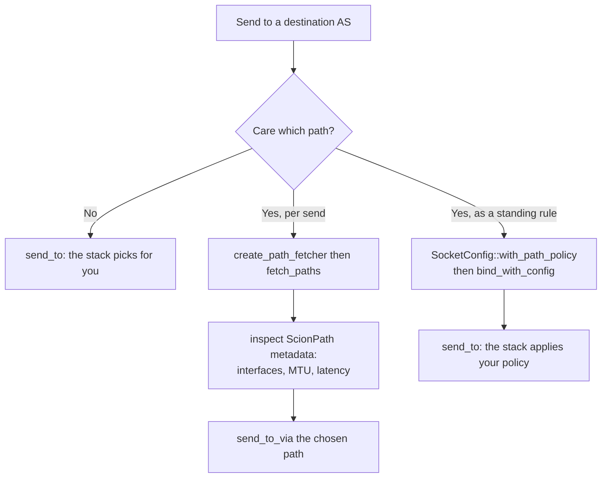

import PathFromSegments from './fig/path-from-segments.drawio.svg';

Path awareness is the feature that sets SCION apart. On the Internet you hand a packet to the network
and it decides, hop by hop, how to get there. You get one route and no say in it. On SCION the
**sender** sees the available paths to a destination and picks which one to use, per packet if it
wants. That control is what buys you multipath, fast failover, and the ability to steer around
networks you would rather avoid.

## What a path is

Between your AS and a destination AS there is usually more than one path, and they differ in the ISDs
and ASes they cross, their MTU, and their latency. A path is not discovered by the network on your
behalf. The SDK fetches the pieces and assembles end-to-end paths that you can inspect and select.

Those pieces are **segments**. SCION paths are built by combining an *up* segment (from your AS
toward a core AS), an optional *core* segment (between core ASes, possibly across ISDs), and a *down*
segment (from a core AS down to the destination). Different combinations yield different end-to-end
paths:

<PathFromSegments
  className="svg-diagram"
  role="img"
  aria-label="A SCION path is built from up, core, and down segments"
/>

You do not have to think in segments to *use* paths. The SDK combines them for you and hands you
finished paths. It matters because it is why several distinct paths exist and why they have the
shapes they do.

## Three ways to choose a path



### Let the stack choose (the default)

If you do not care, do nothing:
[`send_to`](https://docs.rs/scion-stack/latest/scion_stack/struct.UdpScionSocket.html#method.send_to)
on a path-aware socket picks a path for you. The stack keeps the set of paths to each destination
fresh and, by default, orders them sensibly (short and diverse first) and sends over the top one.
This ranking is built in, with nothing to configure, and it is what the
[getting-started](../getting-started.md) echo program relies on.

### Choose explicitly, per send

When you want to see and decide, ask the stack's path fetcher
([`create_path_fetcher`](https://docs.rs/scion-stack/latest/scion_stack/struct.ScionStack.html#method.create_path_fetcher))
for *every* path to the destination AS and inspect them yourself:

```rust reference="@sdk/crates/scion-stack/examples/udp_paths.rs#fetch-paths" title="examples/udp_paths.rs"
```

Each [`ScionPath`](https://docs.rs/sciparse/latest/sciparse/scion/path/struct.ScionPath.html) carries
[`metadata`](https://docs.rs/sciparse/latest/sciparse/scion/path/struct.ScionPath.html#method.metadata):
the interfaces it traverses, its MTU, and latency hints, which is exactly what you would base a
decision on (the example sorts by hop count). Once you hold a path, send over it explicitly with
[`send_to_via`](https://docs.rs/scion-stack/latest/scion_stack/struct.UdpScionSocket.html#method.send_to_via)
instead of `send_to`:

```rust reference="@sdk/crates/scion-stack/examples/udp_paths.rs#send-each" title="examples/udp_paths.rs"
```

### Choose with a policy (a standing rule)

Inspecting paths by hand is right for a one-off decision, but most applications have a *rule*: "never
leave this ISD", "at most N hops", "avoid AS X". Express it once as a **path policy** and attach it
to the socket. Then plain `send_to` honors it automatically.

A [`PathPolicy`](https://docs.rs/scion-stack/latest/scion_stack/path/policy/trait.PathPolicy.html) is
a predicate over a `ScionPath`: return `true` for the paths you are willing to use. This one forbids
any path through a given AS:

```rust reference="@sdk/crates/scion-stack/examples/udp_path_policy.rs#path-policy" title="examples/udp_path_policy.rs"
```

Attach it when you bind, via
[`SocketConfig::with_path_policy`](https://docs.rs/scion-stack/latest/scion_stack/struct.SocketConfig.html#method.with_path_policy)
passed to
[`bind_with_config`](https://docs.rs/scion-stack/latest/scion_stack/struct.ScionStack.html#method.bind_with_config),
after which `send_to` only ever routes over paths that satisfy it:

```rust reference="@sdk/crates/scion-stack/examples/udp_path_policy.rs#bind-with-policy" title="examples/udp_path_policy.rs"
```

You do not have to write predicates from scratch:
[`sciparse`](https://docs.rs/sciparse) ships reusable policies such as hop-pattern and ACL matchers
that implement `PathPolicy` directly.

## When to use which

- **Default:** the common case. You want connectivity and reasonable routing, not control.
- **Policy (`with_path_policy`):** you have a durable constraint such as compliance, reachability, or
  cost. Set it once and the stack enforces it on every send.
- **Explicit (`send_to_via`):** you are making a deliberate, situational choice, probing multiple
  paths, or implementing your own selection logic on top of the metadata.

## Where to go next

- **[Addressing](./addressing.md):** paths are looked up per destination *AS*, so this is how you
  name that AS.
- **[The ScionStack model](./scionstack-model.md):** where path management sits among the stack's
  responsibilities.
- **[`scion-stack` path API](https://docs.rs/scion-stack/latest/scion_stack/path/index.html):**
  `ScionPath`, the path fetcher, and the policy types in full.
