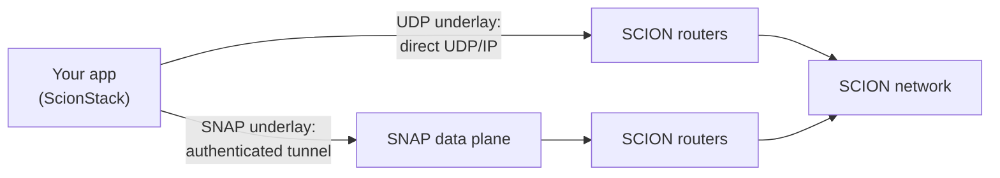
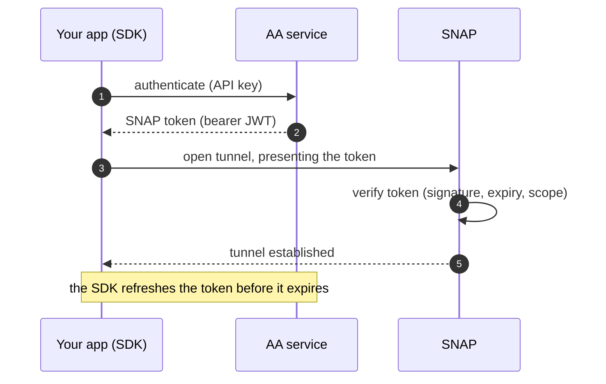

A SCION packet still has to travel over a real network to reach the SCION infrastructure. The
**transport underlay** is that bottom layer: how the SDK moves your packets between your host and the
SCION network. The SDK supports two underlays. This page explains what they are and when to use
each.

## What an underlay is

Your [`ScionStack`](https://docs.rs/scion-stack/latest/scion_stack/struct.ScionStack.html) produces
SCION packets. The underlay carries them to a device that can forward them into the SCION network.
The stack abstracts over more than one underlay so the same socket code works whether you have
direct SCION connectivity or reach the network through an access point. You pick which underlay to
prefer when you build the stack. The choice is otherwise invisible to your application code.



### The UDP underlay

The UDP underlay sends SCION packets directly to the SCION routers in the local AS over UDP/IP. It is
the simplest option and adds nothing between you and the routers: no tunnel and no authentication.
Use it when you have direct SCION connectivity.

### The SNAP underlay

A **SNAP** (SCION Network Access Point) is the edge of the SCION network for endhosts. The SNAP
underlay carries your SCION packets through an authenticated tunnel to a SNAP *data plane*, which
forwards them on to the SCION routers. Use it when you reach SCION through an access point rather
than directly. It is designed to work from behind NAT and across changing networks, and because it
is authenticated it lets the operator authorize and account for your traffic. This is the underlay
you use on real deployments, and the one that requires a SNAP token (see below).

### Choosing an underlay

Prefer an underlay when you build the stack, with
[`with_preferred_underlay`](https://docs.rs/scion-stack/latest/scion_stack/struct.ScionStackBuilder.html#method.with_preferred_underlay)
([`PreferredUnderlay::Snap`](https://docs.rs/scion-stack/latest/scion_stack/stack/builder/enum.PreferredUnderlay.html)
or `Udp`; the default is `Udp`). The stack then selects a matching underlay for the destination AS.
Per-underlay settings live in
[`SnapUnderlayConfig`](https://docs.rs/scion-stack/latest/scion_stack/stack/builder/struct.SnapUnderlayConfig.html)
and [`UdpUnderlayConfig`](https://docs.rs/scion-stack/latest/scion_stack/stack/builder/struct.UdpUnderlayConfig.html);
see the
[`ScionStackBuilder` reference](https://docs.rs/scion-stack/latest/scion_stack/struct.ScionStackBuilder.html).

PocketSCION can simulate **either** underlay so you can develop against both locally: its topology
helpers take an `UnderlayType` (`Snap` or `Udp`). The examples that ship with the SDK build their
network with `UnderlayType::Snap`, so they exercise the SNAP underlay end to end.

## Using the SNAP underlay: tokens

To use the SNAP underlay you must prove you are allowed to. You do that by presenting a **SNAP
token**: a short-lived bearer credential (a signed JWT) that the SNAP verifies before it will carry
your traffic. The token also encodes what you are authorized to do and an identifier the network uses
for accounting. Your application treats it as an opaque string it must supply and keep fresh.



You give the stack a token through a **token source**
([`TokenSource`](https://docs.rs/reqwest-connect-rpc/latest/reqwest_connect_rpc/token_source/trait.TokenSource.html)),
either a static string via
[`with_auth_token`](https://docs.rs/scion-stack/latest/scion_stack/struct.ScionStackBuilder.html#method.with_auth_token)
or a self-refreshing source via
[`with_auth_token_source`](https://docs.rs/scion-stack/latest/scion_stack/struct.ScionStackBuilder.html#method.with_auth_token_source).
Locally, the examples use a fixed development token that PocketSCION accepts
([`pocketscion::util::dev_auth_token`](https://docs.rs/pocketscion/latest/pocketscion/util/fn.dev_auth_token.html)):

```rust reference="@sdk/crates/scion-stack/examples/common/mod.rs#build-stack" title="examples/common/mod.rs"
```

In production you obtain real, short-lived tokens from an **AA** (Authentication and Authorization)
service by presenting an API key, wrapped in a refreshing token source so the SDK fetches a new
token before the current one expires:

{/*TODO(docs): this snippet is hand-written and NOT compiled or checked in CI. Replace it
    with a reference to a CI-checked example (examples/udp_path_policy.rs) once a token or
    AA exchange can be exercised in a PocketSCION-based test.*/}

```rust
use anapaya_aa_client::{ApiKeyTokenRefresher, CrpcAaAuthClient};
use scion_stack::reqwest_connect_rpc::token_source::RefreshTokenSource;
use scion_stack::stack::ScionStackBuilder;

// Exchange an API key at the AA for short-lived SNAP tokens, refreshed in the background.
let refresher = ApiKeyTokenRefresher::new(CrpcAaAuthClient::new(&aa_url)?, api_key, device_id);
let token_source = RefreshTokenSource::builder("aa", refresher).build();

let stack = ScionStackBuilder::new()
    .with_endhost_api(endhost_api)
    .with_auth_token_source(token_source)
    .build()
    .await?;
```

Obtaining API keys and choosing a subscription is an operational step covered in the
going-to-production material.

## Where to go next

- **[The ScionStack model](./scionstack-model.md):** where the underlay fits among the stack's
  responsibilities.
- **[Addressing](./addressing.md)** and **[Paths and path policies](./paths-and-policies.md):** what
  rides on top of the underlay once it is established.
