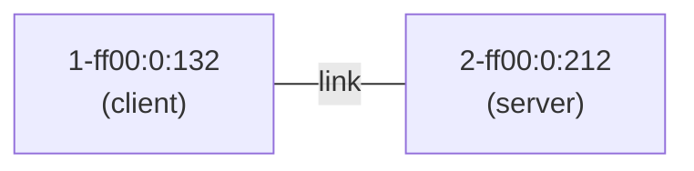

This guide takes you from nothing to a running SCION program in a few minutes. You do **not** need
access to a real SCION network, and you do not need to know anything about SCION yet. Everything
runs locally against PocketSCION, a SCION network simulator that ships with the SDK.

By the end you will have compiled and run a UDP echo client/server that talks
over a simulated SCION network you started yourself.

## What SCION gives you as an application developer

SCION is an inter-domain networking architecture — think of it as an alternative
to today's BGP-routed Internet — with one property that matters most to
application developers: **the application, not the network, chooses the path its
packets take.**

On the SCION network you can:

- **See every path to a destination** and their properties (which ISDs and ASes
  they cross, MTU, latency hints) instead of being handed one opaque route.
- **Pick a path per packet** — steer traffic away from a provider, prefer a
  low-latency route, or spread load across several paths — from application code.
- **Fail over instantly** when a path breaks, because you already hold the
  alternatives.
- **Trust the source**, because SCION paths are cryptographically authenticated.

The SDK's [`scion-stack`](https://crates.io/crates/scion-stack) crate exposes
this through an API deliberately shaped like the sockets you already know:
[`bind`](https://docs.rs/scion-stack/latest/scion_stack/scionstack/struct.ScionStack.html#method.bind),
[`send_to`](https://docs.rs/scion-stack/latest/scion_stack/scionstack/socket/struct.UdpScionSocket.html#method.send_to),
[`recv_from`](https://docs.rs/scion-stack/latest/scion_stack/scionstack/socket/struct.UdpScionSocket.html#method.recv_from).
Path awareness is opt-in — the simplest programs ignore it and let the stack
choose, and you reach for explicit path selection only when you want it (see
[Going further: let your app pick the path](#going-further)).

## Prerequisites

- **Rust** — the SDK pins its toolchain in `rust-toolchain.toml`, so if you have
  [`rustup`](https://rustup.rs/) installed the right version is fetched
  automatically.
- **git**, to clone the repository.
- A supported platform: **Linux**, **macOS**, or **Windows**.

No SCION installation, no root, no network access beyond fetching crates.

## Run your first SCION program

The fastest path to "it works" is to run the `udp_echo` example that ships with
the SDK. Clone the repository and run it with a single command:

```bash
git clone https://github.com/Anapaya/scion-sdk.git
cd scion-sdk
cargo run -p scion-stack --example udp_echo
```

You should see:

```text
echo server listening on <address in 2-ff00:0:212>
client received echo: Hello, SCION!
```

That's a full SCION round-trip: a client in one autonomous system (AS) sent a
datagram to a server in a *different* AS, across a SCION network that the example
started itself, and read back the echo.

## What just happened

The example builds this two-AS network in PocketSCION — a client AS and a server
AS joined by one link:



Here is the whole program. We'll walk through it step by step below.

```rust reference="@sdk/crates/scion-stack/examples/udp_echo.rs" title="scion-stack/examples/udp_echo.rs"
```

### 1. Start a SCION network

`minimal_topology` brings up the two-AS network shown above and returns a handle
that owns the whole simulation. This is the only PocketSCION-specific line —
against real SCION you would skip straight to building the stack.

```rust reference="@sdk/crates/scion-stack/examples/udp_echo.rs#start-pocketscion" title="udp_echo.rs"
```

### 2. Attach a SCION stack to an AS

A `ScionStack` is the SCION equivalent of your OS networking stack: the object
you open sockets on. You build one per AS you want to run code in. The examples
wrap this in a `build_stack` helper:

```rust reference="@sdk/crates/scion-stack/examples/common/mod.rs#build-stack" title="examples/common/mod.rs"
```

### 3. Bind a socket and serve

Bind a UDP socket on the server's stack and hand it to a task that echoes every
datagram back to its sender. `recv_from` yields the sender's SCION address, and
the socket selects a return path automatically, so `send_to` can reply without
the application ever touching SCION path selection:

```rust reference="@sdk/crates/scion-stack/examples/udp_echo.rs#server" title="udp_echo.rs"
```

```rust reference="@sdk/crates/scion-stack/examples/udp_echo.rs#echo-server" title="udp_echo.rs"
```

### 4. Send from the client

Bind a socket on the client's stack and send one datagram to the server's
address. `send_to` picks a SCION path for you; because UDP datagrams can be
dropped, the helper resends a few times before giving up:

```rust reference="@sdk/crates/scion-stack/examples/udp_echo.rs#client" title="udp_echo.rs"
```

```rust reference="@sdk/crates/scion-stack/examples/udp_echo.rs#ping" title="udp_echo.rs"
```

That is the whole surface you need for basic SCION networking: build a stack,
`bind` a socket, `send_to` / `recv_from`. Path awareness — SCION's defining
feature — is one method away when you want it.

## Going further: let your app pick the path {#going-further}

Above, `send_to` chose a path for you. SCION's defining feature is that your
application can *choose* a path from all available ones. Ask the stack's
path fetcher for every path to the destination:

```rust reference="@sdk/crates/scion-stack/examples/udp_paths.rs#fetch-paths" title="udp_paths.rs"
```

Each `ScionPath` carries metadata — the interfaces it traverses, MTU, latency
hints — which is exactly what you'd base a routing decision on. Once you hold a
path, send a datagram on the path with
[`send_to_via`](https://docs.rs/scion-stack/latest/scion_stack/scionstack/socket/struct.UdpScionSocket.html#method.send_to_via)
instead of `send_to`:

```rust reference="@sdk/crates/scion-stack/examples/udp_paths.rs#send-each" title="udp_paths.rs"
```

You can also express a preference declaratively when building the stack, via
`ScionStackBuilder::with_path_policy` and `with_path_scoring`, in which case
`send_to` applies it automatically. The `udp_paths` example puts this all
together against a topology with two paths to the server — run it the same way:

```bash
cargo run -p scion-stack --example udp_paths
```

## Add the SDK to your own project

When you're ready to write your own program, add the stack to your crate:

```bash
cargo add scion-stack
```

To exercise it against a simulated network in your tests and examples, add
PocketSCION as a dev-dependency:

```bash
cargo add --dev pocketscion
```

Then follow the same three steps as above: build a `ScionStack`, `bind` a
socket, and `send_to` / `recv_from`.

## Where to go next

- **Browse the examples** — every example under
  [`scion-stack/examples/`](https://github.com/Anapaya/scion-sdk/tree/main/scion-stack/examples)
  is runnable with `cargo run -p scion-stack --example <name>` and is compiled
  and tested in CI.
- **API reference** — the full API for the stack is on
  [docs.rs/scion-stack](https://docs.rs/scion-stack).
- **PocketSCION** — see
  [`pocketscion/README.md`](https://github.com/Anapaya/scion-sdk/tree/main/pocketscion)
  for the other topologies and underlays you can simulate.
